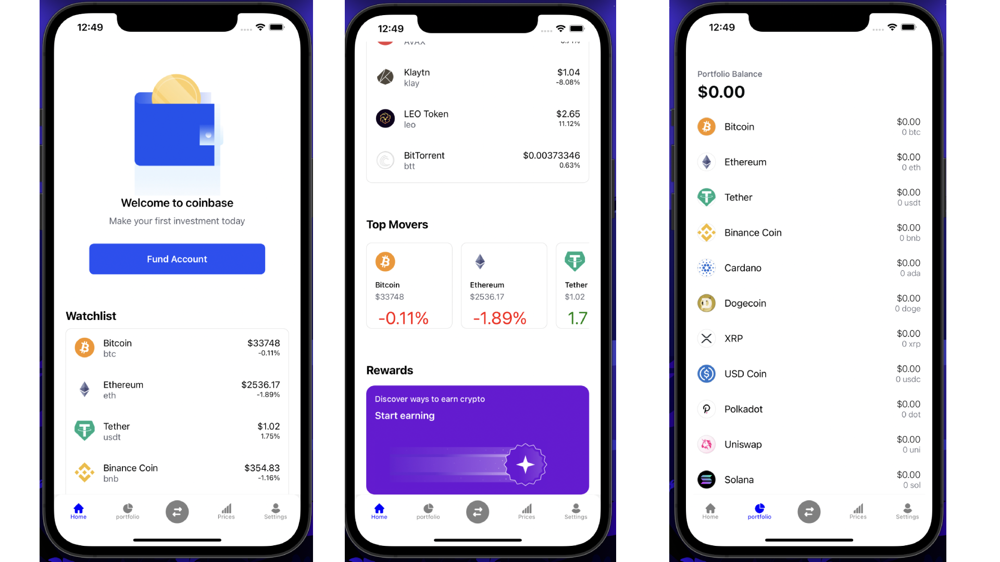
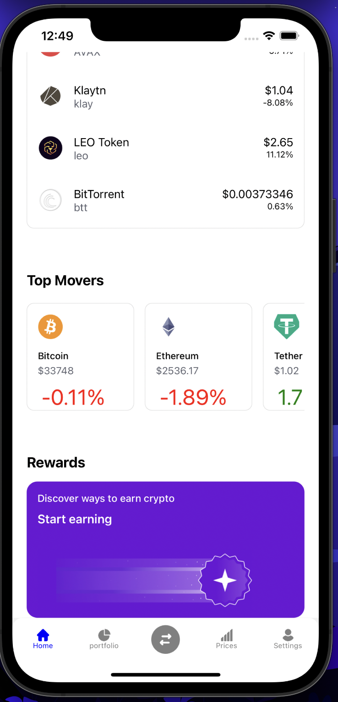
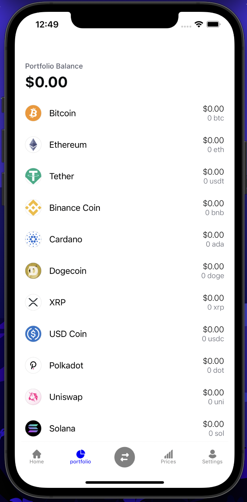
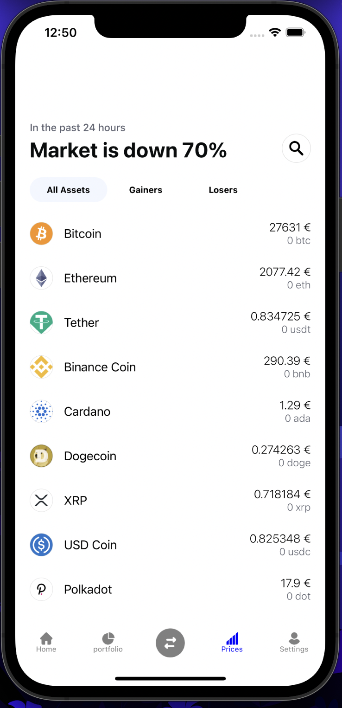
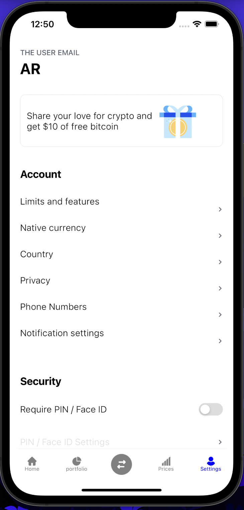

# coinbase-react_native-clone

This is my first project using react-native 

It fetches real data from "https://api.coingecko.com/api/v3/coins/"  and uses it to fill the components for now. Later on it will have more features.

Warning this project is actually my first project using React Native and it is training project and it is only proof of concept

# Images of the mobile app

